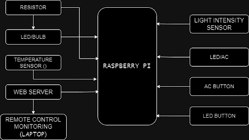

# JEST Home Automation
---
## __Project Description__
> An innovative project aimed at developing a smart home automation and monitoring system for house owners to control their household devices remotely through a user-friendly interface on the web.

For the development and testing of the smart home automation project, the following technologies were used:

1. **Raspberry Pi**: The Raspberry Pi is a single-board computer that serves as the main hardware component for the project. It runs on the Raspberry Pi operating system, which is a variant of Linux.

1. **Python**: Python programming language was used for developing the software logic and controlling the smart home automation system. Python is a versatile language with a wide range of libraries and frameworks that made it suitable for this project.

1. **GPIO Zero**: GPIO Zero is a Python library that provides a simple interface for controlling Raspberry Pi's GPIO pins. It was used to interact with the buttons, LEDs, and other hardware components connected to the Raspberry Pi.

1. **Flask**: Flask is a lightweight web framework for Python. It was used to create a web-based user interface for controlling and monitoring the smart home automation system. Flask allowed users to interact with the system through a web browser.

1. **HTML/CSS**: HTML and CSS were used for designing the user interface of the web application. HTML provided the structure of the web pages, while CSS was used for styling and layout purposes.

1. **Git**: Git was used for version control and collaboration during the development of the smart home automation project. It allowed the team members ([JEST Heat Organization](https://github.com/JEST-HEAT)) to work on the project simultaneously and track changes made to the codebase.

These software tools, platforms, and programming languages were chosen for their compatibility with the Raspberry Pi and their ability to handle the various functionalities required for a smart home automation system.

### Challenges and Future Features

The project typically faced some challenges and limitations due to unavailable sensors and devices during production. Some excluded functionalities and hopeful future features are:

1. **Advanced Automation**: Advanced automation functionalities, such as complex scene creation or integration with specialized systems like motorized blinds or smart irrigation, are excluded from the project due to unavailable sensors and budget constraints.
1. **Security Systems**: The project excludes basic security features such as integrating security cameras, motion sensors, and smart locks for monitoring and controlling access to the home. The project also excludes more advanced security systems like facial recognition, comprehensive surveillance networks, or professional monitoring services.
1. **Advanced Energy Management**: Advanced energy management features like energy monitoring, detailed analytics, or integration with renewable energy sources may be excluded from a small smart home project.
1. **Complex Integrations**: Integrations with specialized or proprietary systems, such as home theatre setups, whole-house audio systems, or advanced home automation protocols, are excluded from the project due to their technical complexity.

---

## __Usage__
Make sure you have [Python3](https://www.python.org/downloads/) and [Pip3](https://pip.pypa.io/en/stable/installation/) (which automatically comes with Python3) installed.

Clone the project onto your personal computer and open the cloned repo:

```bash
git clone https://github.com/JEST-HEAT/Smart-Home.git
cd Smart-Home
```
Install the required packages using pip3:

```bash
pip3 install -r requirements.txt
```
Make the required connections using the Raspberry Pi (as indicated in the [code](https://github.com/JEST-HEAT/Smart-Home/blob/main/app.py))



Run the app with Python or Flask:

```bash
python3 app.py
```

The app can be hosted remotely or accessed via ssh. You can find more on that [here](#jest-home-automation).

Tutorials on how to use the web app are included in the website running the Python app.

---

## __Credits__
- _JEST HEAT Team_:
    - [Juice](https://github.com/Cyberx12345)
    - [Eljay](https://github.com/Eljay5917)
    - [Sarpong](https://github.com/dansarpong)
    - [Tito](https://github.com/Tito-Curtis)
- [GlobalCode Organization](https://globalcode.org.uk/)

## __License__
Copyright &copy; 2023 JEST HEAT Org.
This project is [licensed](https://github.com/JEST-HEAT/Smart-Home/blob/main/LICENSE) under GNU General Public License v3.0.